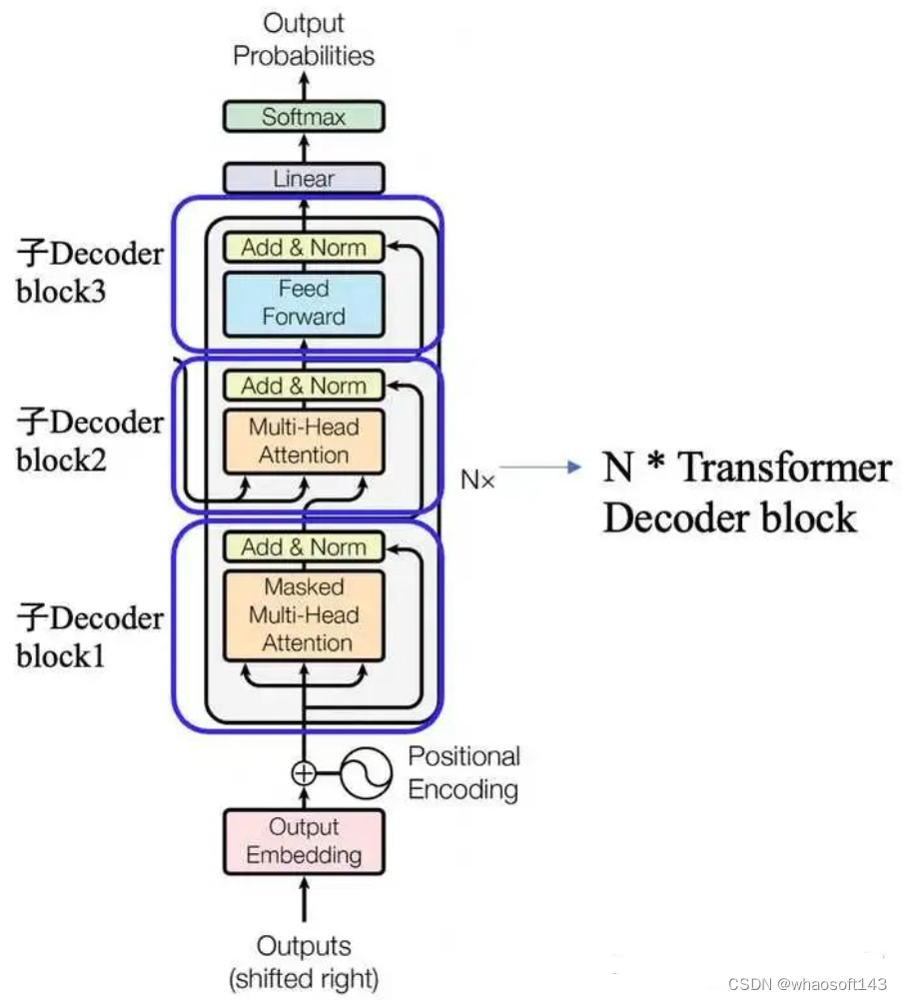
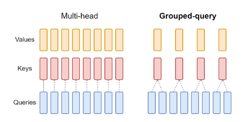

# Дистилляция и ускорение моделей

**ИПИИ НИУ ВШЭ**

## 1. Выбор модели и контекст применения

**Модель**

В качестве объекта исследования была выбрана модель **DeepSeek-R1-Distill-Qwen-14B**. Это языковая модель (LLM), полученная методом дистилляции (обучения на примерах) от флагманской модели DeepSeek-R1, базирующаяся на архитектуре Qwen-2.5-14B, которая демонстрирует выдающиеся способности в математике и коде, соперничая с моделями 70B+, при этом оставаясь достаточно компактной.

**Обоснование выбора**

Оригинальная модель DeepSeek-R1 имеет 671B параметров, что требует для инференса кластер из 8хH100 (около 700 ГБ VRAM в FP8). Анализ такой модели был бы сугубо теоретическим.

Использование 14B модели позволяет спроектировать перенос навыков рассуждения в сверхлегкие модели (1.5B – 3B). Это моделирует реальный индустриальный кейс, когда компания берет уже оптимизированную модель среднего размера и дополнительно сжимает её под конкретную узкую задачу.

**Задача и сценарий использования**

Решение сложных логических, математических и алгоритмических задач. Модель не просто предсказывает следующее слово, а генерирует цепочку рассуждений (токены внутри тегов `<think>...</think>`) перед финальным ответом, чтобы проверить логику решения.

**Сценарий использования:**

* **Цель:** создание бэкенда для образовательного мобильного приложения, которое поможет студентам разбирать сложные задачи по математике, физике и программированию. Главная задача — предоставить не просто сухой ответ, а пошаговое объяснение логики решения.
* **Режим:** Online Inference (интерактивный режим). Пользователь отправляет запрос и ждет решения.
* **Частота запросов:** высокая, с пиками в вечернее время.
* **Объем данных:** текстовые промпты короткие (условия задач), но очень длинные ответы (из-за наличия скрытых рассуждений output модели может быть в 2-3 раза длиннее обычного ответа).
* **Требования к времени ответа:** низкая задержка (Time to First Token - TTFT) для ощущения отзывчивости, допустимая полная задержка (End-to-End Latency) составляет 30–45 секунд, так как генерация качественного рассуждения является ресурсоемким процессом.

---

## 2. Целевая аппаратная платформа

В качестве целевого железа выбрана конфигурация, доступная в облачной среде **Kaggle**.

**Спецификация железа**
* **Тип:** cерверный GPU NVIDIA T4 (архитектура Turing).
* **Конфигурация:** 2 x NVIDIA T4 (через Model Parallelism).
* **Общая память (VRAM):** 30 ГБ (2 x 15 ГБ GDDR6).

**Основные ограничения платформы**

1. **Доступная память:**
   * Это самое критичное ограничение. Модель 14.7B в базовом формате (FP16) занимает ~29.4 ГБ.
   * На одной карте T4 (16 ГБ) запуск невозможен. Даже на двух картах (30 ГБ) свободного места остается 1 ГБ, чего недостаточно для **KV-кэша** при длинных рассуждениях.
   * *Вывод:* необходимо обязательное использование квантования.

2.  **Пропускная способность:**
    * У NVIDIA T4 пропускная способность составляет **~300 ГБ/с** (для сравнения, у A100 — 1500+ ГБ/с).
    * Низкая пропускная способность ограничивает скорость ответа. Каждое чтение весов 14B модели при генерации одного токена занимает значительное время.

---

## 3. Архитектура модели

Модель **DeepSeek-R1-Distill-Qwen-14B** построена на базе архитектуры **Transformer (Decoder-only)** с рядом современных модификаций для эффективности. Это авторегрессионная модель, предсказывающая следующий токен на основе предыдущих.

    

**Ключевые особенности**
* **Параметры:**: 14.7 млрд (требует ~29.4 ГБ VRAM в FP16).
* **Глубина:** 48 слоев.
* **Размер скрытого слоя (Hidden Size):** 5120.
* **Длина контекста:** 131,072 токенов.

**Основные структурные блоки и идеи**

0. **Блок эмбеддингов (Embeddings)**:
    Входной слой, который превращает ID токенов (числа) в векторы размерностью 5120.

1. **Блок внимания (Grouped-Query Attention — GQA):**
    * Вместо стандартного Multi-Head Attention используется **Grouped Query Attention (GQA)**. 
    У модели 40 голов для запросов (Query Heads), но всего 8 голов для ключей и значений (KV Heads).
    * *Идея*: подход позволяет значительно сократить размер KV-кэша, так как несколько голов запросов используют одни и те же головы ключей и значений (Key/Value).

    

2. **Полносвязный блок (Feed-Forward Network — FFN):**
    * Используется Gated Linear Unit с активацией SiLU (SwiGLU). В отличие от классических MLP (где 2 матрицы), здесь используется 3 матрицы. Как показывают исследования, модели со SwiGLU обучаются быстрее и достигают более высокого качества (меньшей перплексии) при том же количестве параметров.
3. **Нормализация (RMSNorm):**
    * Применяется перед каждым слоем внимания и FFN, что стабилизирует обучение и инференc.

4. **Выходной слой (LM Head):**
    * Финальная линейная проекция, которая переводит скрытый вектор обратно в вероятности токенов словаря.

На основе проведенного профилирования (см. файл `profiling_results.json`) выявлено следующее распределение параметров:

| Тип блока | Параметры (млн) | Размер (FP16, ГБ) | % от модели |
| :--- | :--- | :--- | :--- |
| **FFN (SwiGLU)** | **10 192.16** | **18.98** | **69.01%** |
| **Attention (Q/K/V/O)** | 3 020.24 | 5.63 | 20.45% |
| **Embeddings** | 778.57 | 1.45 | 5.27% |
| **LM Head** | 778.57 | 1.45 | 5.27% |

**Ресурсоемкие части модели**

1. **По объёму вычислений:**
   * **Полносвязные блоки (FFN):** каждое прохождение токена через 48 слоев требует перемножения трех огромных матриц размерностью $5120 \times 27392$. 
   * **Механизм Attention:** хотя он занимает лишь 20% параметров, его вычислительная сложность растет квадратично относительно длины текста.

2. **По памяти:**
   * **Полносвязные блоки (FFN):** согласно профилированию, они занимают 18.98 ГБ (69.01%) статической памяти. Именно этот блок делает невозможным запуск модели на одной видеокарте T4.
   * **KV Cache:** при генерации длинных цепочек рассуждений кэш для 131к токенов может занимать десятки гигабайт. Использование GQA снижает нагрузку в 5 раз относительно стандартного Attention, но на контексте 131k токенов кэш всё равно способен вытеснить веса модели из памяти.
   * **Словарь (Embeddings + LM Head):** занимают 2.9 ГБ (10.5%). Это дополнительные затраты, обусловнные огромным размером словаря модели.

3. **По времени выполнения:**
   * **Генерация токенов:** чтобы сгенерировать один токен, нужно прочитать из памяти все 14 млрд параметров. Этот процесс ограничен пропускной способностью шины памяти.

---

## 4. Вычислительные затраты и узкие места

Эмпирические данные согласно результатам профилирования:

*   **Потребление VRAM:** GPU_0: **12.73 ГБ**, GPU_1: **13.33 ГБ**.
*   **Пиковое потребление VRAM:** **14.23 ГБ** (97% лимита карты).
*   **Скорость генерации (Throughput):** **2.18 токенов/сек**.
*   **Общая задержка (Latency):** **206.26 сек** для генерации ответа (450 токенов).

**Основные потребители ресурсов**

1.  **Матричные умножения:**
    * В данной архитектуре они сосредоточены в линейных слоях проекций Attention и в блоке FFN, который составляет 69% параметров модели. Каждое предсказание токена требует миллиардов операций умножения весов на векторы активаций.
2.  **Операции ввода-вывода — перемещение данных:**
    * Это самый дорогой процесс. Чтобы тензорные ядра видеокарты могли что-то умножить, веса модели нужно сначала достать из видеопамяти и передать в вычислительный блок.
3.  **Накладные расходы коммуникации:**
    * Так как мы используем две карты NVIDIA T4, они должны постоянно общаться. Это создает дополнительную задержку.

**Узкие места (Bottlenecks)**

1. **Взаимодействие между двумя GPU**
    * Скорость 2.18 TPS – очень низко и не соответствует теоретическому пределу ($300 \text{ ГБ/с} / 26 \text{ ГБ} \approx 12$ токенов в секунду). Это связано с тем, что модель разделена между двумя GPU и возникают накладные расходы на обмен данными.

2. **Пропускная способность памяти**
   * **Суть:** у NVIDIA T4 скорость чтения из памяти — 300 ГБ/с. При этом модель в формате FP16 весит примерно 26 ГБ.
   * **Проблема:** чтобы выдать всего один токен, GPU должен прочитать из памяти все 26 ГБ весов. Математически: $300 \text{ ГБ/с} / 26 \text{ ГБ} \approx 12$ токенов в секунду. Вычислительные ядра будут простаивать, ожидая данные из памяти.

3. **Дефицит памяти под рассуждения**
   * **Суть:** из 30 ГБ общего объема памяти модель занимает ~26 ГБ ГБ. Оставшиеся **4 ГБ** — это критически мало для хранения KV-кэша длинных цепочек рассуждений.
   * **Проблема:** система выдаст ошибку *Out of Memory*.

---

## 5. Системные ограничения

Для выбранного сценария образовательного ассистента критичными являются следующие ограничения:

1.  **Задержка ответа (Latency):**
    *   **Time to First Token (TTFT):** пользователь ожидает увидеть начало решения в пределах **200-500 мс**. Задержка выше секунды воспринимается как зависание.
    *   **End-to-End Latency:** из-за особенностей модели перед ответом генерируется 500-2000 токенов рассуждений. При текущей скорости (~10 токенов/сек) решение задачи может занимать 1-3 минуты. Это **критичное ограничение**, которое может сделать продукт непригодным для использования.

2.  **Пропускная способность (Throughput):**
    *   Так как генерация одного ответа занимает много времени, одна пара GPU T4 может обслуживать очень мало одновременных пользователей.

3.  **Аппаратные особенности NVIDIA T4:**
    *   Архитектура Turing имеет ограниченную поддержку современных инструкций.
    *   Отсутствие поддержки быстрых ядер **FlashAttention-2**, что ограничивает возможности оптимизации Attention на длинных контекстах. Вместо этого можно использовать аналог **xformers**, который отлично работает на T4.

**Итог:** самым критичным ограничением является **пропускная способность видеопамяти**, которая приводит к низкой скорости генерации токенов (Latency).

---

## 6. Гипотезы по ускорению

Для решения проблем с памятью и скоростью предлагаются следующие методы:

### 1. Квантование до 4 бит
* **Что делает:** снижает точность хранения весов с 16 бит (FP16) до 4 бит (INT4).
* **Затрагиваемые части:** веса линейных слоев, проекции Attention, матрицы FFN.
* **Ожидаемый эффект:**
    *   Размер модели уменьшается с ~26 ГБ до **~7-8 ГБ**.
    *   Модель полностью помещается на **одну** карту T4 (16 ГБ).
    *   Снижается нагрузка на шину памяти в 3-4 раза.
    *   Теоретический предел скорости генерации возрастает с 12 до 35–40 токенов/сек, что делает ответ модели мгновенным для пользователя.
* **Применимость:** наиболее действенный метод для данной конфигурации.

### 2. Использование PagedAttention
* **Что делает:** позволяет хранить KV-кэш не в непрерывных блоках памяти, а постранично (аналогично виртуальной памяти ОС), избегая фрагментации памяти из-за непредсказуемой длины цепочки рассуждений.
* **Затрагиваемые части:** тензоры KV-кэша в блоках Attention.
* **Ожидаемый эффект:**
    * Эффективное использование памяти под кэш.
    * Рост пропускной способности.
* **Применимость:** обязательно для продакшн-сервисов с длинным контекстом.

### 3. Дистилляция в меньшую архитектуру
* **Что делает:** вместо ускорения 14B модели, мы обучаем модель поменьше подражать рассуждениям учителя.
* **Затрагиваемые части:** вся архитектура
* **Ожидаемый эффект:** радикальное снижение требований к памяти и рост скорости.
* **Применимость:** если 14B модель даже после квантования оказывается слишком медленной или дорогой для бизнеса.

---

## 7. Инженерные компромиссы

При внедрении предложенных ускорений возможны следующие компромиссы:

| Метод | Выигрыш | Плата |
| :--- | :--- | :--- |
| **4-bit Quantization** | **Скорость x3-4, Память x0.25**. Модель влезает на дешевое железо. | **Потеря качества.** Для задач, требующих рассуждений, потеря точности может быть критичнее, чем для болталки. |
| **PagedAttention** | **Высокий Throughput.** Нет OOM ошибок из-за фрагментации. | **Сложность инфраструктуры.** Требует использования специализированных серверов инференса (vLLM/TGI) вместо простого кода на PyTorch. |
| **Дистилляция** | **Максимальная скорость и дешевизна.** | **Качество решения.** Маленькие модели хуже справляются с многоходовыми нестандартными задачами. Риск получения глупого помощника. |

В условиях ограниченного железа использование модели 14B в исходном виде (FP16) **невозможно**. Единственный жизнеспособный путь — **агрессивное квантование (4-bit)** в сочетании с **PagedAttention**. Это позволит уместить модель в память и ускорить генерацию до приемлемых значений, пожертвовав незначительной долей точности.

## Используемые источники

**Модель и архитектура:**

1. **DeepSeek-R1 Repo**: [Official GitHub Repository](https://github.com/deepseek-ai/DeepSeek-R1) — описание процесса дистилляции и моделей семейства R1.
2. **Qwen2.5 Technical Report**: [Qwen Blog](https://arxiv.org/pdf/2412.15115) — подробности базовой архитектуры (SwiGLU, GQA).
3. **Grouped-Query Attention**: [Ainslie et al., "GQA: Training Generalized Multi-Query Transformer Models from Multi-Head Checkpoints"](https://arxiv.org/abs/2305.13245).
4. **SwiGLU Activation**: [Noam Shazeer, "GLU Variants Improve Transformer"](https://arxiv.org/abs/2002.05202).

**Аппаратная платформа:**

5. **NVIDIA Tesla T4 Spec Sheet**: [NVIDIA Official Datasheet](https://www.nvidia.com/content/dam/en-zz/Solutions/Data-Center/tesla-t4/t4-tensor-core-datasheet-951643.pdf) — данные по пропускной способности памяти (320 GB/s).

**Методы оптимизации и ускорения:**

6. **PagedAttention / vLLM**: [Kwon et al., "Efficient Memory Management for Large Language Model Serving with PagedAttention"](https://arxiv.org/abs/2309.06180).
7.  **4-bit Quantization**: [Dettmers et al., "Case for 4-bit Precision in Large Language Models"](https://arxiv.org/abs/2212.09720).